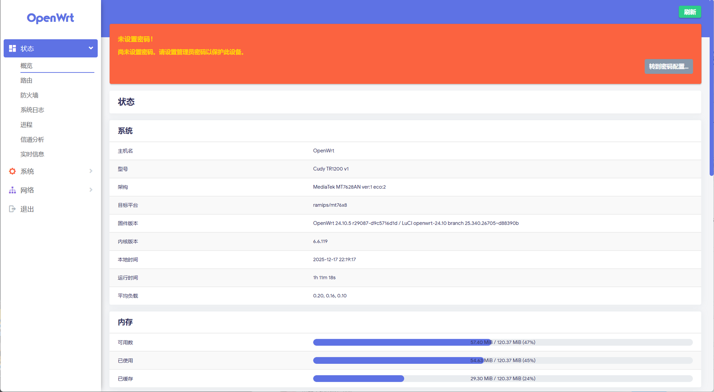

# TR1200-OpenWrt



刷写完成后的 Cudy TR1200 v1 已运行 OpenWrt 24.10.5，并启用 Argon 主题和简体中文界面。

## TR1200 刷机工具

`tr1200_flasher.py` 面向 **Cudy TR1200 v1（R46）**。它只使用 Python 标准库和系统自带的 `scp`/`ssh`，不会直接写入 SPI/MTD 分区。

注意（Windows）: 该工具需要 Python 3.10+、Windows OpenSSH（`ssh`、`scp`、`ssh-keygen`）和 `curl`。可通过环境变量 `TR1200_SSH`、`TR1200_SCP`、`TR1200_SSH_KEYGEN`、`TR1200_CURL` 指定命令。工具默认使用当前用户的 `~/.ssh/known_hosts`，也可通过 `TR1200_KNOWN_HOSTS` 指定路径。主机密钥策略为 `StrictHostKeyChecking=accept-new`：首次连接记录指纹，后续连接严格校验；sysupgrade 后会移除该地址的旧指纹，以便接受重装后生成的新密钥。

安全与校验：该工具严格校验 OpenWrt release 格式（例如 `24.10.5`），并对下载或本地提供的 sysupgrade/initramfs 镜像执行官方 `sha256sums` 校验；拒绝无法验证或型号不匹配的文件。刷写后安装的中文包也从对应 release 的官方 `Packages.gz` 动态解析文件名和 SHA-256，避免跨版本混装。网页服务只监听本机，破坏性请求受每次启动随机令牌、来源校验、目标地址白名单和请求体大小限制保护。

TFTP：内置只读服务遵循 RFC 1350 的基本行为：只允许请求 `recovery.bin` 的 octet 模式，RRQ 使用独立传输 socket/TID，校验客户端地址/端口，设置超时与有限重传，并处理重复 ACK 和 16 位 block rollover。连续超时 5 次会终止本次传输，可重新触发 U-Boot 下载。

### 网页操作界面

启动本地网页控制台：

```powershell
python .\tr1200_flasher.py web
```

然后浏览器打开 `http://127.0.0.1:8765/`。网页支持：

- 区分原厂阶段 `192.168.10.1` 和 OpenWrt 阶段 `192.168.1.1`，检测路由器的 SSH/HTTP 端口是否可连接；
- 原厂阶段输入密码并选择官方签名的 `TR1200-OpenWRT-Flash.bin`，自动登录并上传；
- 下载并校验匹配的官方 sysupgrade 镜像；
- 选择镜像、设置是否保留配置并开始 sysupgrade；
- 正式 OpenWrt 刷写完成后，自动安装 Argon 主题和简体中文；
- 查看后台任务进度和最近 200 条日志。

服务默认只监听 `127.0.0.1`，不会对局域网开放。网页刷写仅适用于**已经运行 OpenWrt 并启用 SSH 的设备**；原厂固件仍需先通过 Cudy 官方签名的 `TR1200-OpenWRT-Flash.bin` 完成过渡。

> **重要：** 请先确认设备标签和硬件版本是 TR1200 v1。不要把本工具用于 TR3000、M1200、RE1200 或其他同名设备。刷机前备份配置，使用网线并确保供电稳定。

### 推荐流程：原厂网页 → OpenWrt

1. 原厂固件管理页是 `http://192.168.10.1/`。本工具网页的“下载 Cudy 中间固件”会从 Cudy 官方 Google Drive 下载 `TR1200 V1.zip` 并提取 `TR1200-OpenWRT-Flash.bin`。在网页输入**管理员密码（默认是 `admin`，不是 Wi‑Fi 密码）**后，工具会自动登录并上传；如果你改过密码，就填修改后的管理员密码。该中间镜像是从原厂固件切换到 OpenWrt 所需的签名镜像，本工具不会伪造或替代它。
2. 设备重启后用网线连接 LAN，访问 OpenWrt 的 `http://192.168.1.1/`。
3. 下载并校验 sysupgrade 镜像：

   ```powershell
   python .\tr1200_flasher.py download sysupgrade --release 24.10.5
   ```

4. 在已经运行 OpenWrt 的 TR1200 上执行升级（默认不保留设置）：

   ```powershell
   python .\tr1200_flasher.py sysupgrade .\images\openwrt-24.10.5-ramips-mt76x8-cudy_tr1200-v1-squashfs-sysupgrade.bin
   ```

使用 `--keep-settings` 才会保留配置；仅在现有配置与目标版本兼容时使用。

### U-Boot TFTP 恢复

这条路径需要拆机连接 **3.3 V UART，115200 8N1**，并在 U-Boot 中进入 TFTP 恢复。电脑网卡按 OpenWrt 文档配置为 `192.168.1.88/24`，网线接 WAN：

```powershell
python .\tr1200_flasher.py download initramfs --release 24.10.5
python .\tr1200_flasher.py prepare-recovery .\images\openwrt-24.10.5-ramips-mt76x8-cudy_tr1200-v1-squashfs-initramfs-kernel.bin
python .\tr1200_flasher.py tftp
```

在 U-Boot 请求文件名时使用 `recovery.bin`。initramfs 只在内存中启动；启动成功后，仍需通过 LuCI 或 SSH 使用 sysupgrade 镜像完成持久化安装。请以设备页的 `/proc/mtd` 为准，切勿直接写入 `factory`、`bdinfo` 或 bootloader 分区。

### 常用选项

```text
download {sysupgrade,initramfs} [-o DIR]
prepare-recovery IMAGE [-o DIR]
tftp [--host HOST] [--port 69] [--directory DIR]
sysupgrade IMAGE [--host 192.168.1.1] [--user root] [--port 22] [--keep-settings]
```

参考：

- https://openwrt.org/toh/cudy/tr1200
- https://firmware-selector.openwrt.org/
- https://www.cudy.com/blogs/faq/openwrt-software-download
